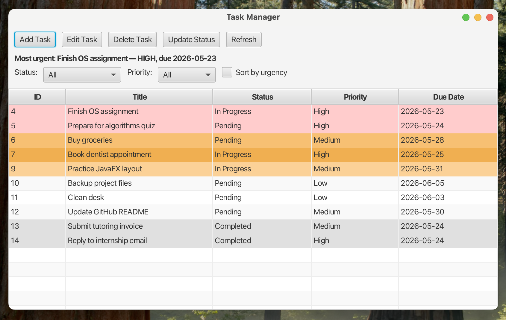
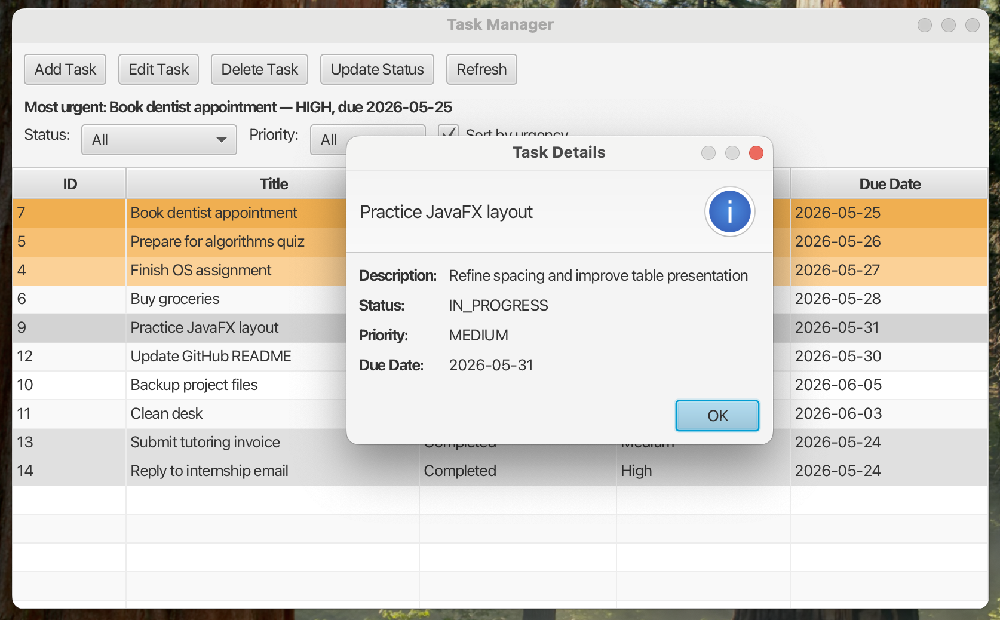

# Task Manager — Java Console + JavaFX
A personal Java project for managing tasks, built to demonstrate clean object-oriented design, layered architecture, file persistence, and a desktop GUI.
This project started as a **console-based task manager** and implemented by myself in order to practice OOP principles, and was later extended with a **JavaFX GUI** by using AI tools for vibe-coding(Claude Code), while keeping the same core business logic and storage layer.
The result is a small but complete application that demonstrates how the same backend can support multiple interfaces.
---
## Overview
The project includes two separate interfaces:
- **Console application**
- **JavaFX desktop application**
  Both versions use the same core components for:
- task modeling
- business logic
- file persistence

  This makes the project a good example of separating **UI**, **logic**, and **storage** responsibilities.
---
## Features
### Core task management
- Create tasks
- View all tasks
- Delete tasks
- Update task status
- Update full task details
- Filter tasks by status
- Filter tasks by priority
- Save tasks to a file
- Load tasks from a file on startup
### Console version
- Menu-driven interaction
- Input validation for task fields
- Save on exit
### JavaFX GUI version
- Table-based task display
- Add Task dialog
- Full task editing with pre-filled values
- Safe deletion with confirmation dialog
- Quick status updates for the selected task
- Filtering by status and priority
- Optional urgency-based sorting
- Double-click task details view
- Dynamic display of the most urgent task
- Visual highlighting for completed, overdue, and top urgent tasks
- Human-friendly formatting for status and priority values
- Automatic save on close
---
## Tech Stack
- **Java 17**
- **JavaFX**
- **Maven**
- **IntelliJ IDEA**
- Plain text file persistence
---
## Project Structure
```text
src/
└── main/
    └── java/
        └── taskmanager/
            ├── Main.java
            ├── model/
            │   ├── Task.java
            │   ├── TaskPriority.java
            │   └── TaskStatus.java
            ├── service/
            │   ├── TaskManager.java
            │   └── UrgencyCalculator.java
            ├── storage/
            │   └── TaskFileRepository.java
            ├── ui/
            │   └── ConsoleUI.java
            └── gui/
                ├── TaskManagerApp.java
                ├── MainWindow.java
                ├── AddTaskDialog.java
                ├── EditTaskDialog.java
                └── TaskDetailDialog.java
```
⸻

## Architecture

The code is organized into clear layers.

### `model`
Contains the domain model and enums:
- `Task`
- `TaskPriority`
- `TaskStatus`

### `service`
Contains the main business logic:
- `TaskManager`
- `UrgencyCalculator`

### `storage`
Responsible for reading and writing tasks to a file:
- `TaskFileRepository`

### `ui`
Contains the console interface:
- `ConsoleUI`

### `gui`
Contains the JavaFX desktop interface:
- `TaskManagerApp`
- `MainWindow`
- `AddTaskDialog`
- `EditTaskDialog`
- `TaskDetailDialog`

### `Main`
The entry point for the console application.

---

## Persistence Format

Tasks are stored in a plain text file, one task per line, using this format:
```
id|title|description|status|priority|dueDate
If a task has no due date, the value none is used.

Example:

1|Finish OS assignment|Processes and scheduling|PENDING|HIGH|2026-05-27
2|Buy groceries|Milk and eggs|COMPLETED|MEDIUM|none
```
Note

For this version of the project, the character | is not allowed inside the task title or description because it is used as the field separator.

⸻

Urgency Logic

The project includes a simple urgency system that takes into account both:

* task priority
* due date proximity

This allows the application to distinguish between:

* a task with high priority but a distant deadline
* a task with medium priority but a very close deadline

Completed tasks are treated as having no urgency.

This urgency logic is used for:

* finding the most urgent task
* optional urgency-based sorting in the GUI
* visual row highlighting of urgent tasks

⸻

## How to Run
```
Compile the project:

mvn compile

Run the console version:

From IntelliJ, run:

taskmanager.Main

Run the JavaFX GUI version:(recommended) 

mvn javafx:run

If needed, the GUI can also be run directly from IntelliJ using:

taskmanager.gui.TaskManagerApp
```
⸻

Console Menu

The console version currently supports:

1. Create task
2. Show all tasks
3. Delete task
4. Update task status
5. Update task
6. Filter tasks
7. Exit

⸻

## Screenshots

### Add Task dialog
This screenshot shows the task creation flow in the JavaFX GUI. The user can enter a title, description, priority, and an optional due date through a dedicated dialog window.


### Filtering by status and priority
This screenshot demonstrates the filtering controls in the GUI. Tasks can be narrowed down by status and priority, making it easier to focus on a specific subset of work.


### Overdue tasks and urgency highlighting
This screenshot demonstrates the urgency visualization system in the JavaFX GUI. Overdue tasks are highlighted in red, while the most urgent active tasks are emphasized with softer highlight colors to help the user prioritize work at a glance.



### Task details view
This screenshot shows the task details dialog that opens when the user double-clicks a row in the table. It provides a quick way to inspect the full task information, including description, status, priority, and due date.


⸻

**Why I Built This Project**

I built this project as a personal portfolio project to strengthen my Java fundamentals and create something clean, structured, and easy to explain.

Instead of building a very large system, the goal was to build a small-to-medium project well:

* clean code
* clear responsibility separation
* practical functionality
* gradual extension from console to GUI

⸻

**What This Project Demonstrates**
```
* Java OOP fundamentals
* separation of concerns
* layered application design
* working with enums, collections, and dates
* file-based persistence
* Maven project structure
* JavaFX desktop GUI development
* building both console and GUI interfaces on the same backend
* incremental project development
* vibe-coding with AI tools
```
⸻

**Possible Future Improvements**
```
* Better GUI styling and layout polish
* Drag-and-drop task ordering
* Category/tag support
* Unit tests
* JSON or database persistence
* More robust handling of special characters in stored text
* Search by keyword
* Due-date calendar view
```
⸻

# Author

Built by Gil Rozen as a personal Java project for learning, fun and portfolio development.
