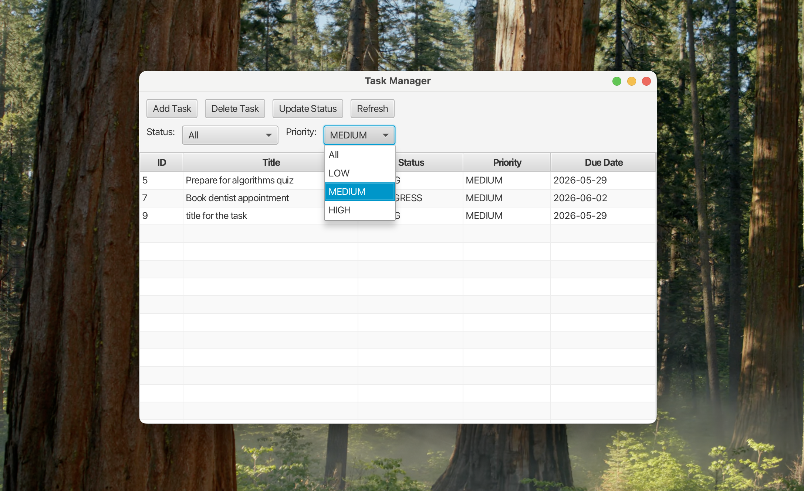

# Task Manager — Java Console + JavaFX
A personal Java project for managing tasks, built to demonstrate clean object-oriented design, layered architecture, file persistence, and a simple desktop GUI.
This project started as a **console-based task manager** and was later extended with a **JavaFX GUI**, while keeping the same core business logic and storage layer.
The result is a small but complete application that shows how the same backend can support multiple interfaces.
---
## Overview
The project includes two separate interfaces:
- **Console application**
- **JavaFX desktop application**
  Both versions use the same core components for:
- task modeling
- business logic
- file persistence
  This makes the project a good example of separating **UI**, **logic**, and **storage** responsibilities.
---
## Features
### Core task management
- Create tasks
- View all tasks
- Delete tasks
- Update task status
- Update full task details
- Filter tasks by status
- Filter tasks by priority
- Save tasks to a file
- Load tasks from a file on startup
---
## Screenshots

### Add Task Dialog


### Filtering in the JavaFX GUI


---

### Console version
- Menu-driven interaction
- Input validation for task fields
- Save on exit
### JavaFX GUI version
- Table-based task display
- Add Task dialog
- Delete selected task
- Update status for selected task
- Filter by status and priority
- Auto-load on startup
- Auto-save on close
---
## Tech Stack
- **Java 17**
- **JavaFX**
- **Maven**
- **IntelliJ IDEA**
- Plain text file persistence
---
## Project Structure
```text
src/
└── main/
    └── java/
        └── taskmanager/
            ├── Main.java
            ├── model/
            │   ├── Task.java
            │   ├── TaskPriority.java
            │   └── TaskStatus.java
            ├── service/
            │   └── TaskManager.java
            ├── storage/
            │   └── TaskFileRepository.java
            ├── ui/
            │   └── ConsoleUI.java
            └── gui/
                ├── TaskManagerApp.java
                ├── MainWindow.java
                └── AddTaskDialog.java

⸻

Architecture

The code is organized into clear layers.

model

Contains the domain model and enums:

* Task
* TaskPriority
* TaskStatus

service

Contains the main business logic:

* TaskManager

storage

Responsible for reading and writing tasks to a file:

* TaskFileRepository

ui

Contains the console interface:

* ConsoleUI

gui

Contains the JavaFX desktop interface:

* TaskManagerApp
* MainWindow
* AddTaskDialog

Main

The entry point for the console application.

⸻

Persistence Format

Tasks are stored in a plain text file, one task per line, using this format:

id|title|description|status|priority|dueDate

If a task has no due date, the value none is used.

Example:

1|Finish OS assignment|Processes and scheduling|PENDING|HIGH|2026-05-27
2|Buy groceries|Milk and eggs|COMPLETED|MEDIUM|none

Note

For this version of the project, the character | is not allowed inside the task title or description because it is used as the field separator.

⸻

How to Run:

Compile the project - 
mvn compile

Run the console version - 

From IntelliJ, run:

taskmanager.Main

Run the JavaFX GUI version - 

mvn javafx:run

If needed, the GUI can also be run directly from IntelliJ using:

taskmanager.gui.TaskManagerApp

⸻

Console Menu

The console version currently supports:

1. Create task
2. Show all tasks
3. Delete task
4. Update task status
5. Update task
6. Filter tasks
7. Exit

⸻

GUI Features

The JavaFX version currently supports:

* displaying tasks in a table
* adding tasks via a dialog
* deleting the selected task
* updating the status of the selected task
* filtering by status and priority
* automatic save on close

⸻

Why I Built This Project

I built this project as a personal portfolio project to strengthen my Java fundamentals and create something clean, structured, and easy to explain.

Instead of building a very large system, the goal was to build a small-to-medium project well:

* clean code
* clear responsibility separation
* practical functionality
* gradual extension from console to GUI

⸻

What This Project Demonstrates

* Java OOP fundamentals
* separation of concerns
* layered application design
* working with enums, collections, and dates
* file-based persistence
* building both console and GUI interfaces on the same backend
* incremental project development

⸻

Possible Future Improvements

* Full task editing from the GUI
* Better GUI styling and layout polish
* Sorting by due date or priority
* Better validation and feedback messages
* Unit tests
* JSON or database persistence
* More robust handling of special characters in stored text

⸻

Author

Built by Gil Rozen as a personal Java project for learning, portfolio development, and interview preparation.
